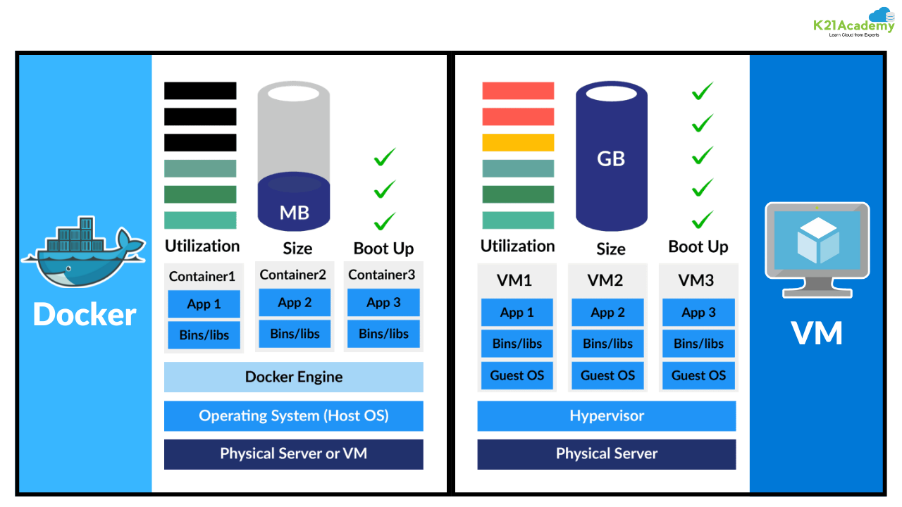

# Evolution of Infrastructure: From On-Premise to Containers

This repository summarizes the evolution of infrastructure technologies and includes a Docker demo for building and deploying a simple web application.

---

## Evolution Overview

### 1. Traditional On-Premise (1960s–1990s)
- **Model:** One application per physical server.
- **Problems:**  
  - Low resource utilization (10–15%).  
  - High costs and energy waste.  
  - Scaling required buying more servers.  
  - Provisioning took weeks or months.  

---

### 2. Virtual Machines (2000s–2010s)
- **Advantages:**  
  - Better hardware utilization (60–80%).  
  - Server consolidation and fast provisioning.  
  - Snapshots, backups, and live migration.  
- **Limitations:**  
  - OS overhead (2–4 GB RAM per VM).  
  - Slower boot times (minutes).  
  - Complex management for multiple OSes.  

---

### 3. Containers & Docker (2010s–Present)
- **Advantages over VMs:**  
  - Efficient resource usage (50–100 MB per container).  
  - Fast startup (seconds).  
  - High portability across environments.  
  - Supports microservices and orchestration (Kubernetes).  
- **Why Docker?**  
  - Simplified container workflows.  
  - Standardized packaging (Dockerfile, Docker Hub).  
  - Developer-friendly tooling.  

---

### Docker vs VMs Summary

| Aspect           | VMs          | Containers    |
|-------------------|--------------|---------------|
| CPU Utilization   | 60–80%       | 80–95%        |
| Startup Time      | Minutes      | Seconds       |
| Memory Overhead   | 2–4 GB       | 50–100 MB     |
| Portability       | Medium       | High          |
| Density           | 10–20 VMs    | 100+ Containers |

---

---

## Docker vs VMs



Source: [k21academy.com](https://k21academy.com/docker-kubernetes/docker-vs-virtual-machine/)
---

## Basic Docker Commands

- **Pull an image:**
  ```sh
  docker pull nginx:latest
  ```
- **Run a container:**
  ```sh
  docker run --name <CONTAINER-NAME> -p <HOST_PORT>:<CONTAINER_PORT> -d <IMAGE_NAME>:<TAG>
  ```
- **Stop a container:**
  ```sh
  docker stop <CONTAINER-NAME or ID>
  ```
- **Start a container:**
  ```sh
  docker start <CONTAINER-NAME or ID>
  ```
- **List running containers:**
  ```sh
  docker ps
  ```
- **List all containers:**
  ```sh
  docker ps -a
  ```
- **List container IDs only:**
  ```sh
  docker ps -q
  ```
- **Remove a container by ID:**
  ```sh
  docker rm -f <ID>
  ```
- **Remove a container by name:**
  ```sh
  docker rm -f <NAME>
  ```
- **Remove an image:**
  ```sh
  docker rmi <IMAGE>
  ```
- **Execute a command in a running container:**
  ```sh
  docker exec -it <CONTAINER> <COMMAND>
  ```
- **Show container hostname:**
  ```sh
  docker exec <CONTAINER> hostname
  ```
- **Show environment variables:**
  ```sh
  docker exec <CONTAINER> printenv
  ```
- **Inspect container details:**
  ```sh
  docker inspect <CONTAINER>
  ```

---

## Example: Build a Custom Nginx Image

**index.html**
```html
<!DOCTYPE html>
<html lang="en">
<head>
    <meta charset="UTF-8">
    <meta name="viewport" content="width=device-width, initial-scale=1.0">
    <title>Docker Demo App</title>
    <style>
        body { font-family: Arial, sans-serif; text-align: center; background: #071561; margin: 0; padding: 0; }
        .container { margin-top: 60px; }
        img { width: 200px; margin-bottom: 30px; }
        h1 { color: #0db7ed; }
        p { color: #0db7ed; }
    </style>
</head>
<body>
    <div class="container">
        
        <h1>Hi Docker!</h1>
        <p>This is a sample app for building a Docker image and pushing to Docker Hub.</p>
    </div>
</body>
</html>
```

**Dockerfile**
```Dockerfile
FROM nginx
COPY index.html /usr/share/nginx/html
```
> We copy to `/usr/share/nginx/html` because that's the default directory Nginx serves static files from.

---

## Build & Push to Docker Hub

1. **Login to Docker Hub:**
   ```sh
   docker login
   ```
2. **Build the image:**
   ```sh
   docker build -t nginx-custom:v1 .
   ```
3. **Tag the image for Docker Hub:**
   ```sh
   docker tag nginx-custom:v1 <your-dockerhub-username>/nginx-custom:v1
   ```
4. **Push the image:**
   ```sh
   docker push <your-dockerhub-username>/nginx-custom:v1
   ```

---

Ready to containerize your first app!
